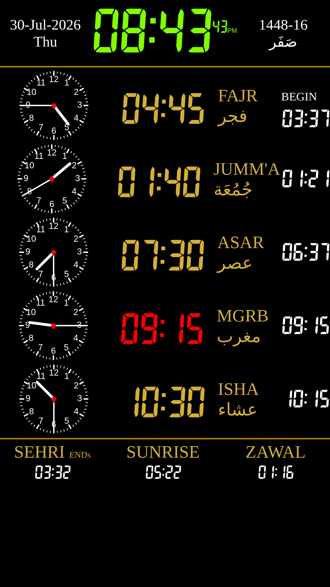

# Masjid Display

[](LICENSE)
[](https://github.com/muddassir-sw/masjid-display/releases/latest)
[](https://www.raspberrypi.com/)
[](https://www.gnu.org/software/bash/)
[](https://www.raspberrypi.com/software/)

A lightweight, reliable Raspberry Pi kiosk platform for displaying prayer timetables, announcements, digital signage and other web-based content on TVs and information screens.

Masjid Display launches a configurable web page in Chromium kiosk mode, automatically recovers from browser failures, performs periodic health checks and is designed for unattended operation in mosques.

This project was developed from a real production deployment and is being published as an open-source reference implementation that other mosques can adapt to their own requirements.

---

## Note About Internal Names

This project is published as **Masjid Display**.

Some internal script names, directories and configuration paths still use the name **taqwa-display**. These names originate from the original production deployment where the software was first developed and tested.

For the purposes of this project, **taqwa-display** simply refers to **Masjid Display**.

The original names have been intentionally preserved in this initial release to keep the repository identical to the tested deployment and to avoid introducing unnecessary changes. Future releases may adopt fully generic internal names while maintaining backwards compatibility.

---

## Screenshot



---

## Features

- Raspberry Pi OS compatible
- Chromium Kiosk Mode
- Automatic browser restart
- Automatic startup after reboot
- Wayland (Labwc) support
- Portrait and landscape display support
- Configurable display URL
- Display wake-up support
- Health monitoring
- Simple shell-based implementation
- SSH administration
- Tailscale compatible
- Designed for reliable 24/7 unattended operation

---

## Why This Project Exists

Many mosques use televisions to display prayer timetables, announcements, fundraising campaigns and community information.

Typical consumer kiosk solutions often require manual intervention when:

- the browser crashes
- the Raspberry Pi restarts
- the display sleeps
- the displayed webpage changes
- remote administration is required

Masjid Display was created to solve these problems with a lightweight collection of shell scripts and configuration files that automatically manage the display environment.

The project intentionally avoids unnecessary complexity while remaining easy to understand, customise and maintain.

---

# High-Level Architecture

```
                    Raspberry Pi OS
                           │
                           ▼
                    Labwc (Wayland)
                           │
                           ▼
                    Launcher Script
                           │
                           ▼
                   Chromium Kiosk Mode
                           │
                           ▼
               Prayer Timetable / Website
```

More detailed documentation is available in **docs/Architecture.md**.

---

# Requirements

## Hardware

- Raspberry Pi 4 (recommended)
- HDMI television or monitor
- Network connection (Wi-Fi or Ethernet)
- Optional USB keyboard during installation

## Software

- Raspberry Pi OS (64-bit)
- Chromium
- Labwc
- systemd
- Wayland

---

# Repository Structure

```
masjid-display
│
├── README.md
├── LICENSE
├── CHANGELOG.md
├── CONTRIBUTING.md
├── CODE_OF_CONDUCT.md
│
├── config/
│   ├── config.env.example
│   └── labwc-autostart
│
├── docs/
│   ├── Architecture.md
│   ├── Commands.md
│   ├── Configuration.md
│   ├── Deployment.md
│   ├── Development-History.md
│   ├── Installation.md
│   ├── Services.md
│   ├── Troubleshooting.md
│   └── TV-Compatibility.md
│
├── images/
│   └── masjid-display-working.jpg
│
├── scripts/
│   ├── taqwa-backup
│   ├── taqwa-healthcheck
│   ├── taqwa-launcher
│   ├── taqwa-status
│   └── taqwa-update-url
│
└── systemd/
    ├── taqwa-healthcheck.service
    └── taqwa-healthcheck.timer
```

---

# Documentation

Detailed documentation is available in the **docs** directory.

- Installation
- Configuration
- Commands
- Services
- Architecture
- Deployment
- Troubleshooting
- TV Compatibility
- Development History

---

# Configuration

Runtime configuration is stored on the Raspberry Pi in:

```
~/.config/taqwa-display/config.env
```

Typical configuration:

```bash
DISPLAY_URL="https://example.org/display"
DISPLAY_OUTPUT="HDMI-A-1"
DISPLAY_TRANSFORM="90"
DISPLAY_MODE=""
HEALTHCHECK_INTERVAL_MINUTES="5"
```

---

# Installation

The current version documents the manual installation process used by the production deployment.

Future releases will include an automated installer.

See:

- docs/Installation.md
- docs/Deployment.md

---

# Available Utilities

The project includes several helper scripts.

### Backup

```
taqwa-backup
```

Creates a backup of the display configuration.

---

### Status

```
taqwa-status
```

Displays:

- Chromium status
- Health check status
- Recent launcher log entries

---

### Update URL

```
taqwa-update-url
```

Updates the configured display URL and restarts Chromium.

---

### Health Check

Executed automatically by the systemd timer.

Checks:

- Chromium
- Website availability
- Display state

---

# Current Status

This repository currently contains the exact scripts and configuration captured from a working Raspberry Pi deployment.

Some internal filenames and configuration paths still reference the original deployment (for example, `taqwa-*` script names and `~/.config/taqwa-display`).

These names have been intentionally preserved in the initial public release to ensure the repository exactly matches the tested production implementation.

Future releases may introduce a generic installer and standardised internal naming while maintaining backward compatibility.

---

# Roadmap

Planned improvements include:

- Automated installer
- Generic deployment process
- Username-independent installation
- Improved logging
- Additional TV compatibility testing
- Automatic updates
- Enhanced diagnostics
- Optional web-based management interface
- Docker development environment
- GitHub Actions CI pipeline

---

# Contributing

Contributions, ideas and bug reports are welcome.

Please read **CONTRIBUTING.md** before submitting pull requests.

---

# Security

Please do not commit:

- SSH private keys
- Wi-Fi passwords
- Tailscale authentication keys
- Production configuration files
- SD card images
- Private deployment information

---

# License

This project is licensed under the MIT License.

See **LICENSE** for details.

---

# Acknowledgements

This project was originally developed and tested for a live mosque deployment and is now being shared to help other mosques build reliable, low-maintenance digital display systems using affordable Raspberry Pi hardware.
